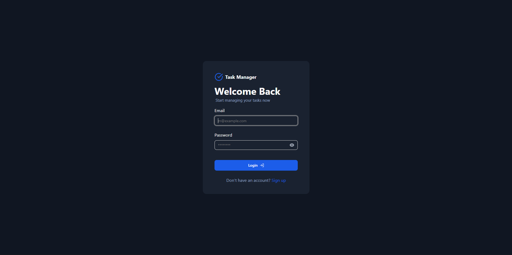
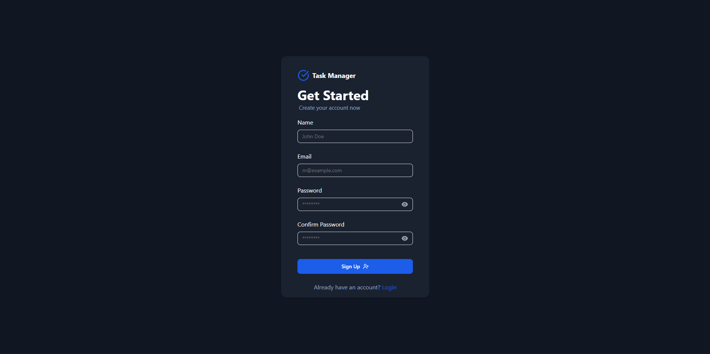
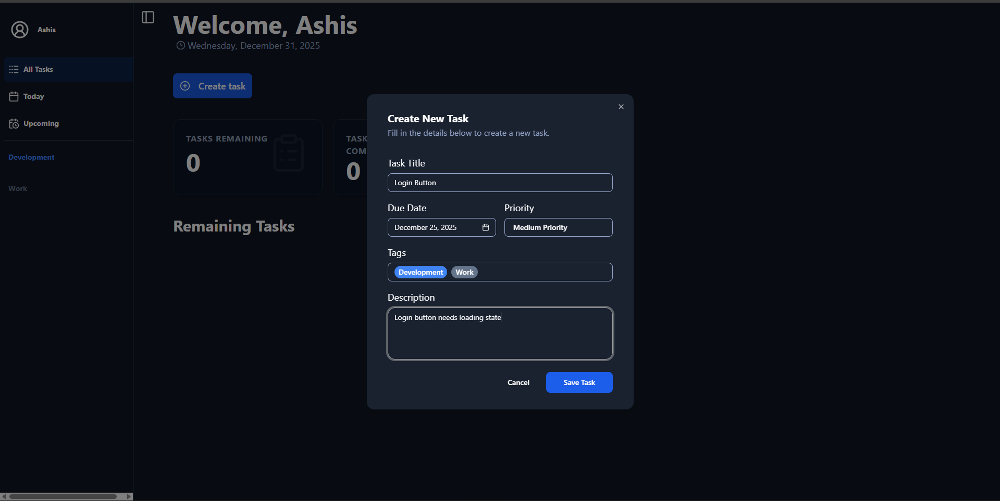
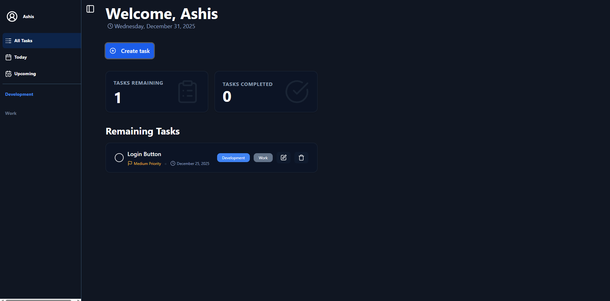

# 📝 Full-Stack Task Manager

A **production-ready, full-stack Task Management application** built with the **PERN stack** (PostgreSQL, Express, React, Node.js).  
Designed with **scalability, security, and clean UI/UX** in mind, this project demonstrates real-world authentication, task workflows, and modern frontend state management.

👉 Ideal for **portfolio, recruiters, and real-world reference projects**.

---

## 🚀 Live Demo

- **Frontend:** https://task-manager-one-snowy-58.vercel.app  
- **Backend:** Hosted on Vercel (Serverless)

---

## 🖼️ Screenshots & Demo GIFs

| Login | Sign Up | Create Task | Dashboard
|--------------------|--------------------|--------------------|--------------------|
|  |  ||  |  |

---

## ✨ Key Features

### 🔐 Authentication & Security
- Secure **User Signup & Login**
- **Email OTP verification** during signup
- **JWT-based authentication**
- Password hashing using **bcrypt**
- Protected routes (frontend + backend)

### 📋 Task Management
- Create, Read, Update, Delete (CRUD) tasks
- Mark tasks as **Completed / Remaining**
- Assign **Due Dates**
- Set **Priority Levels** (Low, Medium, High)
- Organize tasks using **Tags**

### 📊 Dashboard & Productivity
- View tasks for **Today**, **Upcoming**, and **All**
- Quick insights into task completion status

### 🎨 UI / UX
- Responsive design (Mobile + Desktop)
- Built with **Tailwind CSS**
- Accessible UI using **Radix UI**
- Reusable components with **Shadcn/UI**

---

## 🛠️ Tech Stack

### Frontend
- React (Vite)
- TypeScript
- Tailwind CSS
- Zustand (State Management)
- React Router DOM
- Axios
- Radix UI, Shadcn/UI
- Lucide React Icons

### Backend
- Node.js
- Express.js
- TypeScript
- PostgreSQL (NeonDB / Vercel Postgres)
- JWT Authentication
- Nodemailer (OTP Emails)
- bcrypt
- pg (node-postgres)

---

## 📡 API Documentation

### 🔐 Auth Routes
| Method | Endpoint | Description |
|------|---------|-------------|
| POST | `/api/auth/register` | Register user & send OTP |
| POST | `/api/auth/verify-otp` | Verify email OTP |
| POST | `/api/auth/login` | Login user |
| GET | `/api/auth/me` | Get logged-in user |

---

### 📋 Task Routes (Protected)
| Method | Endpoint | Description |
|------|---------|-------------|
| GET | `/api/tasks` | Get all tasks |
| POST | `/api/tasks` | Create new task |
| PUT | `/api/tasks/:id` | Update task |
| DELETE | `/api/tasks/:id` | Delete task |
| PATCH | `/api/tasks/:id/status` | Update task status |

---

### 🏷️ Tag Routes (Optional)
| Method | Endpoint | Description |
|------|---------|-------------|
| GET | `/api/tags` | Get all tags |
| POST | `/api/tags` | Create new tag |

---

## ⚙️ Environment Variables

### Server (`server/.env`)
```env
PORT=5000
PGUSER=your_db_user
PGHOST=your_db_host
PGDATABASE=your_db_name
PGPASSWORD=your_db_password
JWT_SECRET=your_super_secret_key
EMAIL_USER=your_email@gmail.com
EMAIL_PASS=your_email_app_password
FRONTEND_URL=http://localhost:5173
```

### Client (`client/.env`)
```env
VITE_API_URL=http://localhost:5000
```

---

## 💻 Local Setup

### 1️⃣ Clone the Repository
```bash
git clone https://github.com/ashis05/task-manager.git
cd task-manager
```

### 2️⃣ Backend Setup
```bash
cd server
npm install
npm run dev
```

### 3️⃣ Frontend Setup
```bash
cd client
npm install
npm run dev
```

---

## 🗂️ Project Structure

```text
task-manager/
├── client/
│   ├── src/
│   │   ├── components/
│   │   ├── pages/
│   │   ├── store/
│   │   └── App.tsx
│   ├── vercel.json
│   └── vite.config.ts
│
└── server/
    ├── controller/
    ├── routes/
    ├── db.ts
    └── server.ts
```

---

## 🚀 Deployment

- **Frontend:** Vercel (Vite Static Build)
- **Backend:** Vercel Serverless Functions
- **Database:** Neon / Vercel Postgres

---

## 👤 Author

**Ashis**  
GitHub: https://github.com/ashis05  

---

## 📄 License

ISC License
